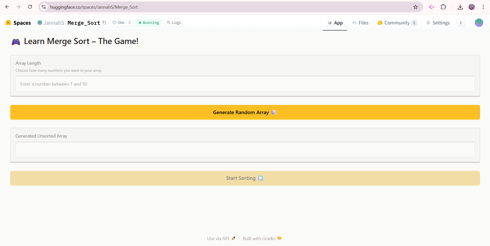
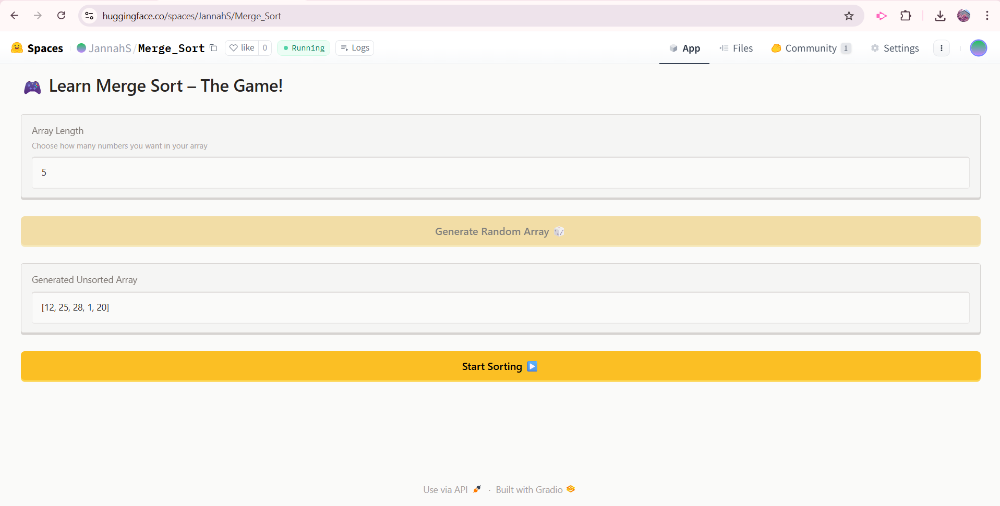
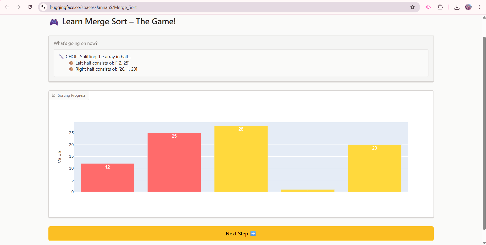
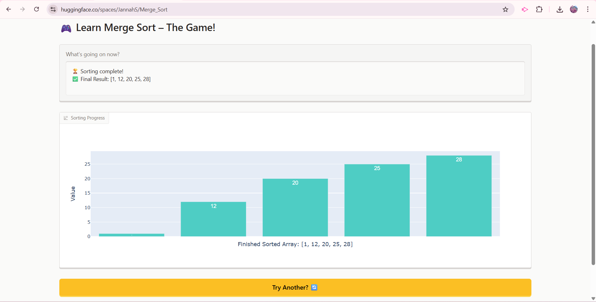
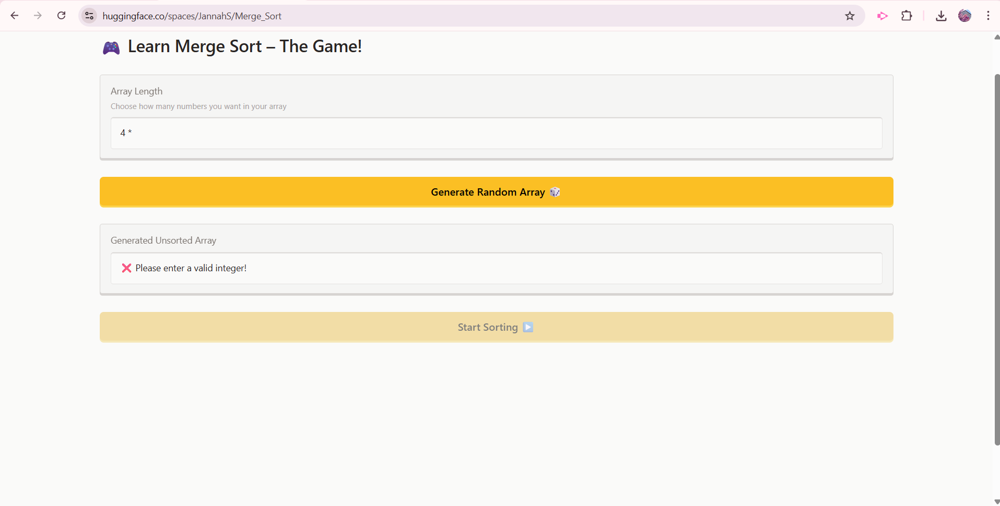

# ALGORITHM NAME: Merge_Sort

# SCREENSHOTS: 
### Initial Interface - Array Generation

*User enters desired array length and generates random unsorted array*

### Generated Array

*Random array is displayed*

### Step-by-Step Visualization - Sorting

*The algorithm splits and merges with colored bars*

### Final Result

*The fully sorted array with success message*

### Error Handling

*Validation prevents invalid inputs with helpful error messages*

# DEMO VIDEO: 
**[Watch Full Demo Video](https://drive.google.com/file/d/1Z9pehUnhumExNNQUfcRtPdDOpK9wy1Rn/view?usp=sharing)**

# STEPS TO RUN:
Locally (needs Python 3.8 or higher): 
    1) Clone repository: "git clone https://github.com/JannahSultan/Merge_Sort.git", "cd Merge_Sort"
    2) Install dependencies: "pip install -r requirements.txt"
    3) Run application: "python app.py"
    4) Open in browser (app will open automatically)
    
# HUGGING FACE LINK: https://huggingface.co/spaces/JannahS/Merge_Sort

# AUTHOR AND ACKNOWLEDGMENTS:
Author: Jannah Sultan
Course: CISC-121 - Intro to Computing I
Institution: Queen's University
Date: 9th December 2025
Acknowledgments: Course Proffessor for project guidelines, Gradio for UI library, Hugging Face for free hosting platform, Claude AI for debugging help

# TESTING AND VERIFICATION:

    Test 1: Small Array (Length = 5)
            Input: Length = 5
            Generated Array: [12, 3, 27, 8, 15]
            Expected: Sorted in ascending order
            Result: Final array: [3, 8, 12, 15, 27]

    Test 2: Single Element (Length = 1)
            Input: Length = 1
            Generated Array: [42]
            Expected: Immediate completion (base case)
            Result: Array already sorted: [42]

    Test 3: Maximum Array (Length = 50)
            Input: Length = 50
            Generated Array: [30, 6, 23, 94, 1, 46, 49, 49, 36, 50, 15, 17, 6, 24, 85, 60, 100, 73, 76, 67, 66, 24, 71, 66, 70, 85, 22, 25, 94, 18, 15, 82, 27, 83, 90, 27, 91, 25, 67, 22, 70, 36, 3, 6, 37, 49, 47, 50, 47, 98]
            Expected: Successfully sorts large array
            Result: All elements in ascending order

    Test 4: Medium Array (Length = 20)
            Input: Length = 20
            Generated Array: [8, 3, 24, 30, 28, 19, 7, 18, 12, 21, 5, 30, 19, 27, 26, 29, 21, 14, 27, 8]
            Expected: Clear visualization of multiple recursion levels
            Result: Sorted in ascending order

### Edge Case Testing

    Edge Case 1: Empty Input
                 Input: "" (blank field)
                 Expected: Error message
                 Result: "⚠️ Please enter a number!"

    Edge Case 2: Non-Integer Input
                 Input: "abc"
                 Expected: Error message
                 Result: "❌ Please enter a valid integer!"

    Edge Case 3: Negative Number
                 Input: -5
                 Expected: Error message
                 Result: "❌ Array length must be positive!"

    Edge Case 4: Exceeding Maximum
                 Input: 100
                 Expected: Error message
                 Result: "❌ Array length cannot exceed 50!"

    Edge Case 5: Zero Input
                 Input: 0
                 Expected: Error message
                 Result: "❌ Array length must be positive!"

    Edge Case 6: Decimal Number
                 Input: 5.5
                 Expected: Error message
                 Result: "❌ Please enter a valid integer!"

# PROBLEM BREAKDOWN AND COMPUTATIONAL THINKING:
I chose to implement Merge Sort because I already understood its "divide and conquer" strategy well, so I could easily visualize it in a step by step demonstration. The splitting and merging phases are distinct and easy to show graphically. It also has a constant time complexity (O (n log n)), so there are no worst case scenarios where it becomes extremely slow, and therefore, the visualization runs smoothly regardless of input, making it reliable for demonstrations like mine.

## DECOMPOSITION: 
My algorithm can be be decomposed into smaller more manageable parts, almost like steps to help me plan out what to implement:
  1) Create a random unsorted array based on user input of length
       1.1) Check if input is valid (positive integer within limits)
       1.2) Display error messages for each failure (empty, not int, negative, out of range, etc.)
       1.3) Enable/disable UI controls based on validation result
  2) Implement Merge and Sort functions
       2.1) Split left and right sub arrays (based on midpoint) until only single elements
       2.2) Sub-Arrays with 0 or 1 elements are already sorted
       2.3) Compare current elements from each side and choose the smaller to add to resultant array
       2.4) Add remaining elements from either side and return merged sorted array
  3) Create step-by step control system
      3.1) Create generator to pause between each step in sorting algorithm
      3.2) Track current position in sorting process and continue when next step button clicks
      3.3) Yield control back to UI after each operation (step)
      3.4) Detect when full array sorted and move to completion UI
  4) Create visualization (UI) system
      4.1) Create bar chart with :
             - array values as bar heights,
             - value labels, and
             - colours to signify each operation (left and right halves, single element in base case, inactive elements, and a default) 
  6) Create user feedback system
      5.1) Add text explanations for each step (in splits, comparisons, final result, etc.)
      5.2) display current operation and sub array in bar plot
  7) Create state management system
      6.1) Store unsorted array globally
      6.2) Track UI components' visibility states
      6.3) Manage button enable/disable states
      6.4) Handle transitions between phases (generate to sort to reset)
  8) Create reset/restart system
      7.1) Clear all stored data
      7.2) Reset UI to initial configuration
      7.3) Re-enable disabled controls

## PATTERN RECOGNITION:
  1) Every array length user input goes through the same validation sequence:
       1.1) Recieve input, Check if Empty, Check if int, Check range, 
       1.2) Return result or Error
  2) The Merge Sort repeatedly applies divide and conquer:
       2.1) If not 1 element, split in half, recurse on left + right halves.
       2.2) If 1 element, already sorted (base case) 
  3) UI updates always follow a specific pattern (User Action, Process Data, Update Multiple Components, Enable/Disable Controls), e.g. :
       3.1) Generate button click, validate, create array, update textbox, toggle buttons
       3.2) Start sorting, initialize, show barplot, hide inputs, enable next step
       3.3) Next step, process algorithm, update visualization, update text, check completion
       3.4) Reset, clea data, hide barplot, show inputs, disable sorting
  4) During every merge operation, the same comparison loop executes to move elements that are smaller to the result array
      4.1) repeats for every pair of sub-arrays being merged
  5) Every step triggers the same visualization sequence (Algorithm Operation, Determine active region, Assign colors, Update barplot, Display text)
  6) The step by step control uses a consistent yield pattern (Perform Operation, Package Data (type, message, array, range), Yield to UI, Wait for next click)
      6.1) Every significant algorithm step yields control
      6.2) UI always receives consistent 4 - element tuple
  7) UI controls follow predictable enable/disable sequences with defined button states, triggered by user actions
      7.1) Phase 1:
             - length input enabled
             - generate button enabled
             - start sorting button disabled
      7.2) Phase 2:
             - length input disabled
             - generate button disabled
             - start sorting button enabled
      7.3) Phase 3:
             - all generating array controls hidden
             - next step button enabled
      7.4) Phase 4:
             - next step button disabled
             - reset button enabled
  8) All error handling follows the same structure with emoji prefixes and clear user friendly language (Detect Invalid Input, Generate Error Message (emoji + text), Return to User, Keep UI in Safe State)

## ABSTRACTION:
The user is shown information that is essential to the GUI and to their understanding of the merge sort algorithm. They don't see, however, the implementation details behind that GUI. 
    1) SHOWN TO USER:
        1.1) The array values as visual bars in chart
        1.2) Which section is currently being processed (with coloured highlighting)
        1.3) Simple text explanations vital to their understanding of how merge sorting works e.g.
              - "Splitting left: [3, 7] and right [1, 5]"
              - "Comparing 3 vs 1, added 1 from right half to sorted array"
        1.4) Final sorted result with success message
    2) HIDDEN FROM USER:  
        2.1) Memory addresses and pointers
        2.2) Array index arithmetic (offset calculations)
        2.3) Recursion call stack depth
        2.4) Generator/yield mechanics
        2.5) Gradio state management
        2.6) Python-specific syntax

## ALGORITHM DESIGN:
To put it simply, the user enters the desired array length and the program generates an array of randomized numbers of that length. When start sorting button is pressed, the barplot visualization shows, and when the next step button is pressed the merge sort goes through the array and sorts it visually. After the final sorted result is visible, the user can reset the interface and try another input.

  1) Page 1: Generating an Array
        INPUT: a positive integer between 1 and 50 in array length field
        PROCCESSING: Validating user input. If valid, generate random array of that length, if invalid, show error message and wait for next input attempt
        OUTPUT: Display array as list: [a, b, c, d] and enable the start sorting button
     
  2) Page 2: Initializing the Sorting
        INPUT: User clicks the start sorting button
        PROCCESSING: Creating step-by-step controller for merge sort and generating initial barplot visualization
        OUTPUT: Show coloured bars representing array values, display next step button, and show instructions ("Click next step to begin sorting")
     
  3) Page 3:Stepping through Sorting (repeatedly)
        INPUT: User clicks next step button
        PROCCESSING: Executing one algorithm step, determining which bars to highlight, and generating explanation text
        OUTPUT: Update bar plot with new colours, display text explanation of what just happened, and keep next step button active (User clicks next step button repeatedly until array is sorted)
              NOTE: When complete, show all bars in final colour, display sorted message, and show 'try another?' button
     
  4) Page 4: Resetting Page to Start
        INPUT: User clicks 'try another?' button
        PROCCESSING: Clearing all data and resetting UI to initial state
        OUTPUT: Return to array length input screen to be ready to generate a new array
     
  5) FLOWCHART:
     
     
     
